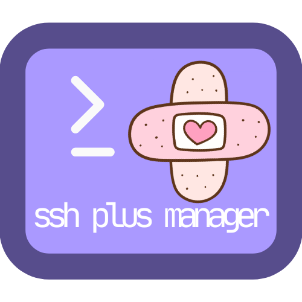

**Language / زبان:** [English](README.md) | [فارسی](README.fa.md)

<p align="center"></p>

<div dir="rtl">

# SSH Plus Manager

ابزار ساده‌ای برای مدیریت کاربران SSH روی سرور. ایجاد کاربر، تنظیم رمز، محدودیت اتصال هم‌زمان و تاریخ انقضا.

## قابلیت‌ها

- ایجاد و حذف کاربر SSH
- تغییر رمز کاربران
- محدودیت تعداد اتصال هم‌زمان برای هر کاربر
- تنظیم تاریخ انقضای کاربران
- مشاهده اتصالات فعال
- مدیریت سرویس‌های شبکه

## نصب

یکی از این دستورها را روی سرور اجرا کنید (در صورت داشتن `curl` از اولی، در غیر این صورت از دومی با `wget`):

<div dir="ltr">

```bash
# در صورت داشتن curl:
bash <(curl -Ls https://raw.githubusercontent.com/namnamir/SSH-Plus-Manager/main/install.sh)
```

```bash
# در صورت داشتن wget (یا نبود curl):
wget -qO- https://raw.githubusercontent.com/namnamir/SSH-Plus-Manager/main/install.sh | bash
```

</div>

**پیش‌نیاز:** یکی از `curl` یا `wget` لازم است. با کاربر root اجرا شود. در سیستم‌های مینیمال ممکن است قبلاً یکی را نصب کنید، مثلاً:
- Debian/Ubuntu: `apt update && apt install -y curl` یا `apt install -y wget`
- CentOS/RHEL: `yum install -y curl` یا `yum install -y wget`

## استفاده

پس از نصب، دستور `menu` را بزنید تا منوی اصلی باز شود.

## مستندات

- **[راهنمای استفاده](docs/USAGE.fa.md)** — همه گزینه‌ها و قابلیت‌های منو
- **[رفع مشکلات](docs/TROUBLESHOOTING.fa.md)** — مشکلات رایج و راه‌حل
- **[تنظیم چند پورت SSH](docs/SSH-MULTIPORT.fa.md)** — پورت‌های چندگانه SSH با systemd و UFW

نسخه انگلیسی: [docs/USAGE.md](docs/USAGE.md) · [docs/TROUBLESHOOTING.md](docs/TROUBLESHOOTING.md) · [docs/SSH-MULTIPORT.md](docs/SSH-MULTIPORT.md)

## مجوز

این پروژه تحت مجوز MIT است — جزئیات در [LICENSE](LICENSE).

</div>
